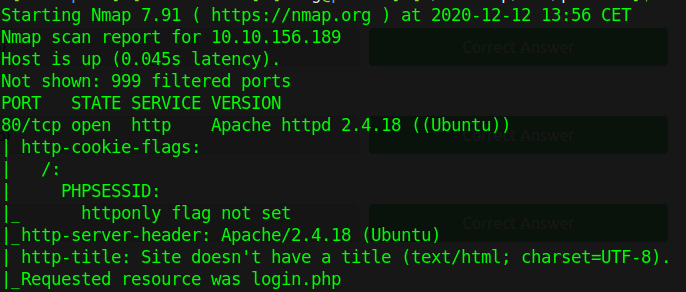
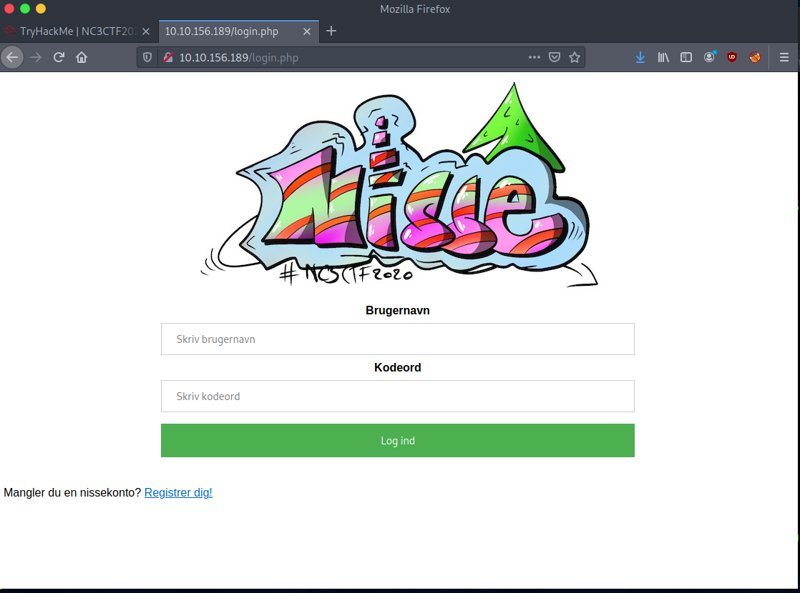
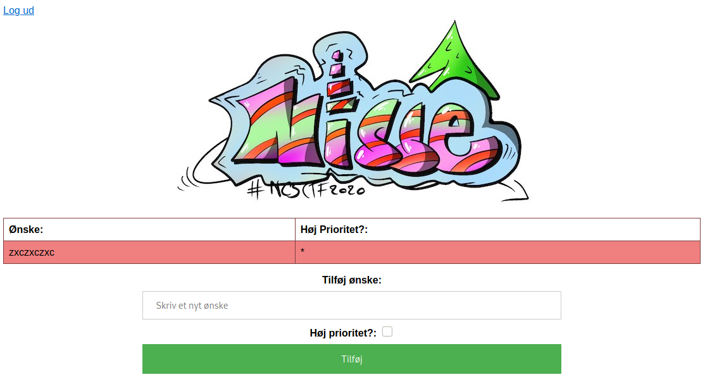
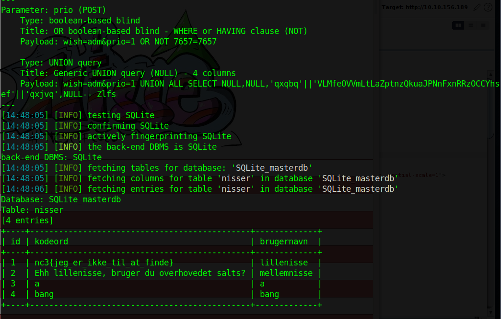
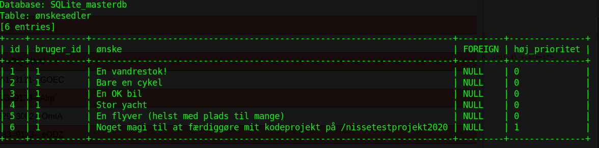
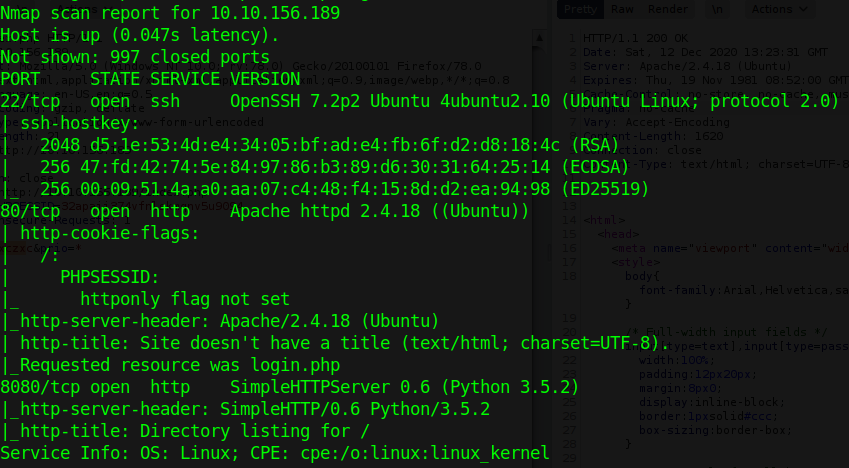
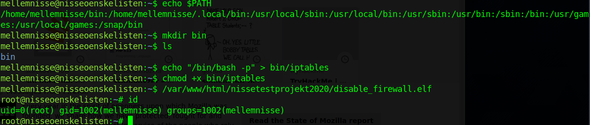

[Back](README.md)

## Boot2Root Challenges was hosted at tryhackme.com

[Link to room](https://tryhackme.com/room/nc3ctf2020nisseonskelisten)

Description

```html
Udfør en pentest af maskinen: Nisseønskelisten.
```

---

## 200 - B2R Lillenisse

Starting out just running a simple portscan, to reveal whats listening on the machine.

`nmap -sV -sC <ip>`



We see that the only port currently open is `80/tcp`, we can start up a web content discovery bruteforce and visit the http server. It's sometimes a good idea, but im going to hold off on starting such an attack for now.

We're greeted with a login page, we can also sign up. Using `Burp` to aid poking around the login form and sign up form, doesnt yield much results and bruteforcing is almost never the answer when little to no information is known, and we dont know much at this point.



Signing up with whatever user, i just did `bang:bang`, to see what is next.

Next we see that we can post wishes to the server, lets try seeing what we can do here.



Capturing the request in `Burp` and saving it (`Copy to file`), allows me to run automated tools like `sqlmap` next.

After running through a few differnet dbms's we find that sqlite is the dbms of choice.

The command used to dump the database:

`sqlmap -r wishes.req -p "prio" --level 5 --risk 3 --threads 10 --dbms sqlite --batch --dump`

We see the flag for lillenisse in the ``Nisser`` table



Flag: *nc3{jeg_er_ikke_til_at_finde}*

Its a good idea to let it run for a while, as we see theres also a table named `ønskesedler`, which contains data that we did not submit.

And this leads us into `Mellemnisse`.

---

## 200 - B2R Mellemnisse

After a while of extracting data from `ønskesedler` table, we see that a few wish that we didnt submit:



The interesting part is the wish with Id 6.

```html
Noget magi til at færdiggøre mit kodeprojekt på /nissetestprojekt2020
```

Visiting `http://<ip>/nissetestprojekt2020` gives us a button to click `"Gå i DEV mode"`, examining the source html, gives us an idea that it disables some firewall that was in place.

Rerunning `nmap -sV -sC <ip>`



This reveals 2 new ports open, ssh and another webserver on 8080.

Next up is visiting port 8080.

Here we're greeted with a "Directory listing" of just a single elf file called `"nisseadgang.elf"`

Opening this file in e.g. ghidra, you will see it start a socket listener on port 4545, and sure enough the machine is also listening on this port (quick `"nc \<ip> 4545"` test), so i would assume this is the same binary.

Moving on, inside the binary theres an interesting function, called `"ErKodeordKorrekt"` which takes our input and sees if it + '\\0x1' matches whats stored in `"g_flagEncrypted"`.

Extracting the `"g_flagEncrypted"` data, and the way its checked, i wrote a quick python script to decode it.

```python
encrypted = [
0x6F,0x03,0x64,0x03,0x34,0x03,0x7C,0x03,0x62,0x03,0x63,
0x03,0x73,0x03,0x62,0x03,0x6C,0x03,0x62,0x03,0x65,0x03,
0x62,0x03,0x63,0x03,0x73,0x03,0x62,0x03,0x60,0x03,0x6D,
0x03,0x76,0x03,0x6C,0x03,0x60,0x03,0x65,0x03,0x6A,0x03,
0x68,0x03,0x60,0x03,0x70,0x03,0x71,0x03,0x7E,0x03]

def solve():
    s = ""
    for i in range(0, 27):
        s += chr(encrypted[i*2] - 1)
    print(s)

solve()
```

Flag: *nc3{abrakadabra_luk_dig_op}*

This flag is also the password for getting in through `nisseadgang.elf` and getting a shell.

---

## 200 - B2R Storenisse

Now we can try and connect to port 4545, and give it the flag as password.

We get into this barebone shell, so i thought it would be a good idea to drop a public key in /home/mellemnisse/.ssh/authorized_keys.

Connecting to the machine via ssh, and running whatever linux enumeration scripts should get you to the next thing, which is the suid binaries located on the machine.

Unintended root way -> see how i did root part.

The interesting one for getting storenisse user is `"/home/storenisse/import_ønsker.elf"`.

Downloading the binary and opening in e.g. ghidra, lets us peek at whats in store for us.

I wont go into details for the exploit development process, my environment is a mess, and im not that experience to teach others the correct things about pwn'ing.

Basically we need to write enough data to control `EIP`, i found it easy to put in a "jmp esp", because we control the data there.

Feel free to take a closer look at the [sourcecode.](b2r/storenis.py)

Transferring the file to the machine and running it like:

```sh
/home/storenisse/import_ønsker.elf $(cat /tmp/<exploit file>)
```

Flag found in `/home/storenisse/storenisse.txt`

Flag: *nc3{jul_th3_w0r1d_2o20}*

## 300 - B2R Root

I couldnt find root via the bulkimport binary and cba to continue trying, so i did it via probably unintended way.

- Note: you can do this from either mellemnisse and skip storenisse, or do it from storenisse after you done the bufferoverflow exploit.

The binary that disables the firewalls doesnt specify absolute path to iptables, its also owned by root and SETUID to root.

Path Abuse example



Flag found in `/root/root.txt`

Flag: *nc3{g0dt_gaaet_m3ster_n1sse_og_glaedelig_jul_fra_nc3}*

---

[Back](README.md)
