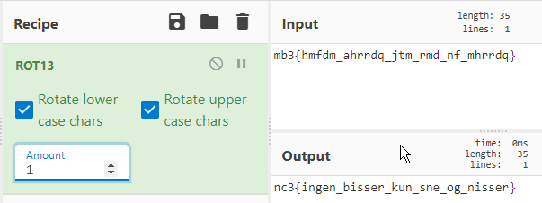
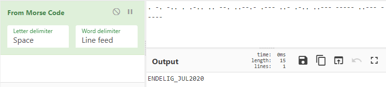

[Back](README.md)

## 100 - Introduktion til CTF

Provided description - [source](easy/introduktion_til_ctf.txt)

```html
Vi starter ud med en opgave for alle. Se mønsteret og find sætningen.

Husk at et flag er inklusiv: nc3{}

Introduktion til CTF
-------------------------------------------------------------------------------

Hvad står der mon her?

mb3{hmfdm_ahrrdq_jtm_rmd_nf_mhrrdq}
```

First look at the text tells me that its a cipher thats not changing numbers and special characters like underscore and curly brackets.

First test is seeing if this is a shift cipher, beginning with ROTX.

it looks to be ROT1.



Flag: *nc3{ingen_bisser_kun_sne_og_nisser}*

---

## 100 - Besked fra fronten

Provided description - [source](easy/besked_fra_fronten.txt)

```html
Besked fra fronten
--------------------------------

nc3{JiM2ODsmIzgyOyYjNzM7JiM3NjsmIzc2OyYjNjk7JiM3ODsmIzczOyYjODM7JiM4MzsmIzY5OyYjODM7JiM0ODsmIzEwODsmIzc3OyYjODQ7JiMxMjE7JiM2NjsmIzY2OyYjODQ7JiM2OTsmIzkwOyYjNjY7JiM3MzsmIzY5OyYjMTIwOyYjNzQ7JiM4NDsmIzg1OyYjNjk7JiMxMDM7JiM4MjsmIzY5OyYjODY7JiM3NzsmIzg2OyYjNjk7JiM2OTsmIzEwMzsmIzgyOyYjODU7JiM3ODsmIzczOyYjODQ7JiMxMjE7JiM2NjsmIzgzOyYjODQ7JiM0ODsmIzQ5OyYjNzA7JiM4NDsmIzEyMTsmIzY2OyYjNzE7JiM4NjsmIzg1OyYjMTIwOyYjNzc7JiM3MzsmIzcwOyYjNzg7JiM4NTsmIzg0OyYjNDk7JiM2NTsmIzEwMzsmIzgxOyYjODU7JiMxMjA7JiM3MTsmIzgxOyYjODM7JiM2NjsmIzc3OyYjODM7JiM4NTsmIzQ5OyYjNjY7JiM3MzsmIzY5OyYjMTIwOyYjNzQ7JiM4NDsmIzg1OyYjNjk7JiMxMDM7JiM4MjsmIzg1OyYjNzg7JiM3MzsmIzg0OyYjMTIxOyYjNjY7JiM3MTsmIzg2OyYjODU7JiMxMjA7JiM3NzsmIzczOyYjNzA7JiM3ODsmIzg1OyYjODQ7JiM0OTsmIzY1OyYjMTAzOyYjODU7JiMxMDc7JiM1NzsmIzc4OyYjODI7JiM4NTsmIzU2OyYjMTAzOyYjODE7JiM4NTsmIzEyMDsmIzcxOyYjODE7JiM4MzsmIzY2OyYjODQ7JiM4MzsmIzg1OyYjODY7JiM4MzsmIzg1OyYjMTA3OyYjNjk7JiMxMDM7JiM4MzsmIzQ4OyYjMTA4OyYjNzc7JiM4NDsmIzEyMTsmIzY2OyYjNzA7JiM4MTsmIzQ4OyYjMTA0OyYjODA7JiM3MzsmIzY5OyYjOTA7JiM4NjsmIzg0OyYjNjk7JiMxMTk7JiMxMDM7JiM4NTsmIzQ5OyYjODI7JiM4MDsmIzg1OyYjNjc7JiM2NjsmIzc5OyYjODQ7JiM0OTsmIzkwOyYjNzA7JiM4NDsmIzg1OyYjNzQ7JiM3MDsmIzg1OyYjMTA1OyYjNjY7JiM3NDsmIzg0OyYjMTA3OyYjODI7JiM3NDsmIzgxOyYjODM7JiM2NjsmIzg0OyYjODM7JiM4NTsmIzg2OyYjODM7JiM4NTsmIzEwNzsmIzY5OyYjMTAzOyYjODU7JiM0ODsmIzEwODsmIzcwOyYjODU7JiMxMDg7JiM3NDsmIzY2OyYjNzM7JiM2OTsmIzg2OyYjNjg7JiM4MzsmIzY5OyYjNTY7JiMxMDM7JiM4NTsmIzEwNzsmIzU3OyYjNzg7JiM4MjsmIzg1OyYjNTY7JiMxMDM7}
```

At first glance the text inside nc3{}, looks repeated alot which leads me to believe its been encoded.

Extracting the text inside the brackets and running it through Base64 decode yields html entities e.g. `&#69;`

```html
DRILLENISSES0lMTyBBTEZBIExJTUEgREVMVEEgRUNITyBST01FTyBGVUxMIFNUT1AgQUxGQSBMSU1BIExJTUEgRUNITyBGVUxMIFNUT1AgUk9NRU8gQUxGQSBTSUVSUkEgS0lMTyBFQ0hPIEZVTEwgU1RPUCBOT1ZFTUJFUiBJTkRJQSBTSUVSUkEgU0lFUlJBIEVDSE8gUk9NRU8g
```

It does look a bit sus to have `DRILLENISSE` to be the start of that, because the rest still doesnt make sense.

Trying to remove the `DRILLENISSE` and base64 decoding the rest.

```html
KILO ALFA LIMA DELTA ECHO ROMEO FULL STOP ALFA LIMA LIMA ECHO FULL STOP ROMEO ALFA SIERRA KILO ECHO FULL STOP NOVEMBER INDIA SIERRA SIERRA ECHO ROMEO 
```

Searching for `KILO ALFA LIMA DELTA ECHO ROMEO FULL STOP` on e.g. google points us in the direction of [NATO phonetic alphabet.](https://en.wikipedia.org/wiki/NATO_phonetic_alphabet)

Trying to decode with NATO phonetic alphabet.

- `KALDER.ALLE.RASKE.NISSER`

Flag: *nc3{KALDER.ALLE.RASKE.NISSER}*

---

## 100 - Hallo, hallo, er der nogen?

Provided description - [source](easy/hallo.txt)

```html
Hallo, hallo, er der nogen?
------------------------------------------------------------------

nc3{. -. -.. . .-.. .. --. ..--.- .--- ..- .-.. ..--- ----- ..--- -----}
```

Its obvious to see its some kind of code, and in this case its [Morse Code.](https://en.wikipedia.org/wiki/Morse_code)

Using Cyberchef or your favorite morse code translator...



Flag: *nc3{ENDELIG_JUL2020}*

---

## 100 - Rosettestenen

Provided description - [source](easy/rosettestenen.txt)

```html
Rosettestenen
--------------------------------------

Vi har her et gammelt, ukendt og meget mystisk ordsprog:


neque eleifend In non aliquet nec Quisque auctor neqte id risus vel


Men vi har været så heldige at finde en Rosettesten, der måske kan bruges til at afkode mystikken. Vi tænker at resultatet skal afleveres uden mellemrum.


Rosettesten viste:
-------------------
Quisque vel risus non neque aliquet auctor nec id neqte In eleifend
gammel } flasker er nc3 sådan vand set nye i det {
```

I've created a short python script to help with solving this matching exercise.

Basically we're shown the right order of the rosettestone, and then the one matching our flag.

```python
right_order = ["neque", "eleifend", "In", "non", "aliquet", "nec", "Quisque", "auctor", "neqte", "id", "risus", "vel"]
current_order = ["Quisque", "vel", "risus", "non", "neque", "aliquet", "auctor", "nec", "id", "neqte", "In", "eleifend"]
flag = ["gammel", "}", "flasker", "er", "nc3", "sådan", "vand", "set", "nye", "i", "det", "{"]

for x in right_order:
    print(flag[current_order.index(x)], end="")
```

[sourcecode](easy/rosette.py)

Flag: *nc3{detersådansetgammelvandinyeflasker}*

---

## 100 - Julegåden 0

Provided description - [source](easy/julegaden.7z)

```html
Denne opgave er et samlet eventyr i 5 bind. Hent her starten, der skal bruges i de efterfølgende opgaver:

Nissen Malus Atmosphaerum var i dårlig stemning efter begivenhederne i 2020. Der var derfor mistanke om at han ville forsøge at spolere julen i år.
Mistanken blev opdaget af detektivnisserne Videlicet Sursum og Antrorsum Retrorsum, der hurtigt stoppede ham i hans forehavende. De vil dog gerne vide hvad hans plan var.
De tog derfor en kopi af de vigtigste data fra hans arbejdspc til undersøgelse.
Kan du hjælpe med finde ud af hvad planen var?

Koden til den zipfilen "0.7z" står i tekstfilen som Malus har forsøgt at modificere navnet på.
```

Extract the 7z and read the instructions. Some elf have tried messing with the password file to the next 7z, opening it can yield lots of different views of it.

I initially opened it in Notepad++, which gave me the right view of the password, but there's some special characters placed in there to mess with copying of it.

```html
Koden er: ‮2020‭Nisse‮jul‭Bar‮eDen‭bedste
```

Solution to this was to avoid copying.

Using "NisseBarbedsteneDeluj0202" unlocked the next 7z.

Flag: *NC3{usynlige_tegn_til_læseretning}*

---

[Back](README.md)
