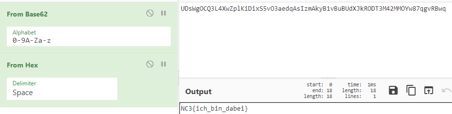

[Back](README.md)

## 200 - Befibbet

Provided description - [source](medium/befibbet.txt)

```html
Befibbet
-------------------------------------------------------------------------------

En befibbet nisse bruger tech. fra 1202 og/eller eksklusive designs fra flere århundrede senere. Kan du finde hoved og hale i hvad vi har skrevet med denne mærkelige algoritme?:

0x6e, 0x62, 0x32, 0x79, 0x61, 0x60, 0x6e, 0x64, 0x65, 0x52, 0x52, 0x2d, 0xcf, 0x85, 0x11c, 0x20d, 0x3b5, 0x65c, 0xa6a, 0x1031, 0x1a02, 0x2a9d, 0x4543, 0x6f94, 0xb544, 0x12574, 0x1da43, 0x2ff1d, 0x4d916, 0x7d8d3, 0xcb25c, 0x148ab8, 0x213d77, 0x35c7bd, 0x570480, 0x8ccca8, 0xe3d1c6, 0x1709e1c, 0x254705b, 0x3c50efd, 0x6197ea2, 0x9de8d32, 0xff80c4c, 0x19d699c4, 0x29cea5b1, 0x43a53fee, 0x6d73e53a, 0xb119248f, 0x11e8d0a25, 0x1cfa62f7e, 0x2ee33393e, 0x4bdd968e4, 0x7ac0ca186, 0xc69e60a01, 0x1415f2ac3c, 0x207fd8b6f2, 0x3495cb6291, 0x5515a419d7, 0x89ab6f7cc8, 0xdec113965f, 0x1686c8312b1, 0x2472d96a967, 0x3af9a19bbbd, 0x5f6c7b06496, 0x9a661ca20e4, 0xf9d297a85f9, 0x19438b44a63d, 0x28e0b4bf2b9b, 0x42244003d223, 0x6b04f4c2fe27, 0xad2934c6d0d0, 0x1182e2989ceb4, 0x1c5575e509f0e, 0x2dd8587da6e54, 0x4a2dce62b0dec
```

The description hints at using the fibbonacci sequence to do something to this provided number sequence.

So i thought to take the provided data into a python script and test what we can do to get a flag.

It seems that getting the fibbonacci number of a provided number index and then XOR'ing that with the provided number gives a printable character when clamping to one byte.

```python
provided = [0x6e, 0x62, 0x32, 0x79, 0x61, 0x60, 0x6e, 0x64, 0x65, 
0x52, 0x52, 0x2d, 0xcf, 0x85, 0x11c, 0x20d, 0x3b5, 0x65c, 0xa6a, 
0x1031, 0x1a02, 0x2a9d, 0x4543, 0x6f94, 0xb544, 0x12574, 0x1da43, 
0x2ff1d, 0x4d916, 0x7d8d3, 0xcb25c, 0x148ab8, 0x213d77, 0x35c7bd, 
0x570480, 0x8ccca8, 0xe3d1c6, 0x1709e1c, 0x254705b, 0x3c50efd, 0x6197ea2, 
0x9de8d32, 0xff80c4c, 0x19d699c4, 0x29cea5b1, 0x43a53fee, 0x6d73e53a, 0xb119248f, 
0x11e8d0a25, 0x1cfa62f7e, 0x2ee33393e, 0x4bdd968e4, 0x7ac0ca186, 0xc69e60a01, 0x1415f2ac3c,
0x207fd8b6f2, 0x3495cb6291, 0x5515a419d7, 0x89ab6f7cc8, 0xdec113965f, 0x1686c8312b1, 
0x2472d96a967, 0x3af9a19bbbd, 0x5f6c7b06496, 0x9a661ca20e4, 0xf9d297a85f9, 0x19438b44a63d, 
0x28e0b4bf2b9b, 0x42244003d223, 0x6b04f4c2fe27, 0xad2934c6d0d0, 0x1182e2989ceb4, 
0x1c5575e509f0e, 0x2dd8587da6e54, 0x4a2dce62b0dec]

# quick fibbonacci calculation
# https://stackoverflow.com/a/23462371
def fib(n): 
    v1, v2, v3 = 1, 1, 0
    for rec in bin(n)[3:]:
        calc = v2*v2
        v1, v2, v3 = v1*v1+calc, (v1+v3)*v2, calc+v3*v3
        if rec == '1':
            v1, v2, v3 = v1+v2, v1, v2
    return v2

for i, x in enumerate(provided):
    if i > 0:
        x ^= fib(i)
    print(chr(x & 0xFF), end="")
```

[sourcecode](medium/befibbet.py)

Flag: *nc3{befippet_leonardo_leder_efter_gaver_i_tallene__fedt_du_fandt_denne_ene}*

---

## 200 - Kludetæppet

Provided description - [source](medium/kludetaeppet.txt)

```html
Kludetæppet
-------------------------------------------------------------------------------

Vi har fundet noget Python kode, som måske skal rettes lidt til før det virker efter hensigten:

ting = ["nc3", "gjort", "{", "specielt", "}", "_", "selv", "vel", "jule", "er", "med", "gaver", "guld"]

opskrift = [1, 3, 7, 2, 6, 10, 6, 8, 2, 6, 4, 6, 11, 6, 9, 12, 5]

kludeTaeppe = ''
for tal in opskrift :
    t = ting[tal]
    kludeTaeppe += t

print kludeTaeppe
```

Analyzing the sourcecode, we spot that opskrift numbers are used as list indicies, but in python atleast these start from 0.

```python
ting = ["nc3", "gjort", "{", "specielt", "}", "_", "selv", "vel", "jule", "er", "med", "gaver", "guld"]

opskrift = [1, 3, 7, 2, 6, 10, 6, 8, 2, 6, 4, 6, 11, 6, 9, 12, 5]

kludeTaeppe = ''
for tal in opskrift :
    t = ting[tal-1] # <--- this, opskrift indicies are 1 off
    kludeTaeppe += t

print kludeTaeppe
```

Flag: *nc3{selvgjort_er_velgjort_specielt_med_julegaver}*

---

## 200 - Nisse Omvendt

Provided description - [source](medium/nisse_omvendt.txt)

```html
nisse_omvendt.py
--------------------------------------

Ja, så skete det: Lillenisse lavede en sindsyg krypterings algoritme, og var SÅ stolt. Dejligt for ham. Men pludselig skete det, der bare ikke må ske: Hans computer crashede imens han ændrede i koden! Hans dekryptering er væk!! For altid?!

kodet_besked.bin:

8F 57 F0 B7 A2 9D AC AD AE 9B 93 98 98 93 95 96
A3 A0 9D 9E AB AE AF A8 9C AC A5 AF B3 AF C7 BC
A7 B2 B5 B3 AA A5 B3 B8 BE CA C3 C8 CB BF D0 DA


nisse_omvendt.py:

import sys

besked = sys.argv[1]

filnavn = 'kodet_besked.bin'

kodet_besked = ''
for i in range(0, len(besked)):
    c = ord(besked[i])
    nc = ord(besked[(i + 1) % len(besked)])
    c = (c ^ 64) & 0xFF
    c = (c -  1) & 0xFF
    c = (c ^  1) & 0xFF
    c = (c +  i) & 0xFF
    c = (c +  nc) & 0xFF
    kodet_besked += chr(c)

f = open(filnavn, 'w')
f.write(kodet_besked)
f.close()


f = open(filnavn, 'r')
kodet_besked = f.read()
f.close()

dekodet_besked = ''
for i in range(0, len(kodet_besked)):
    c = ord(kodet_besked[i])
$$2133248hfdsfBIIIIPP!!!123213123dddddCRASH!
```

Analyzing the algorithm used, it seems like we can write a decryption because its deterministic encryption.

Testing encryption of a `character - "c"` and its `next character - "nc"`, and repeating for the rest of the message should yield one string in the end, passing by the correct starting character should lead the way to the flag.

```python
import string

testable_chars = list(map(ord, string.printable))
kodet_besked = [
    0x8F, 0x57, 0xF0, 0xB7, 0xA2, 0x9D, 0xAC, 0xAD, 0xAE, 0x9B, 0x93, 0x98,
    0x98, 0x93, 0x95, 0x96, 0xA3, 0xA0, 0x9D, 0x9E, 0xAB, 0xAE, 0xAF,0xA8, 
    0x9C, 0xAC, 0xA5, 0xAF, 0xB3, 0xAF, 0xC7, 0xBC, 0xA7, 0xB2, 0xB5, 0xB3, 
    0xAA, 0xA5, 0xB3, 0xB8, 0xBE, 0xCA, 0xC3, 0xC8, 0xCB, 0xBF, 0xD0, 0xDA
]

def encrypt(c, nc, i):
    c = (c ^ 64) & 0xFF
    c = (c - 1) & 0xFF
    c = (c ^ 1) & 0xFF
    c = (c + i) & 0xFF
    c = (c + nc) & 0xFF
    return c

def test_nc(test, expected, i):
    for nc in testable_chars:
        encrypted = encrypt(test, nc, i)
        if encrypted == expected:
            return test, nc
    return 0, 0

def run(besked):
    for c in testable_chars:
        result = ""
        test_char = c
        for i, b in enumerate(besked):
            test, nc = test_nc(test_char, b, i)
            result += chr(test)
            test_char = nc
        if "nc3" in result: # not needed if statement 
            print(result)

run(kodet_besked)
```

[sourcecode](medium/nisse_omvendt.py)

Flag: *nc3{yessss_jeg_har_lavet_en_ubrydelig_algoritme}*

---

## 200 - Dllosaurus

Provided description - [source](medium/Dllosaurus.7z)

```html
Kategori: Reversing

Nissa, den lille tyske nisse, har stjålet julemandens julegaver. 
På social media skrev hun: "Det er slut med julen for dette år! 
Kampen i mod jul er på! Vær med på #JulenErSlut!".
Det danske nisseforbund kunne spore hvor beskeden blev sendt fra og har fundet ud af, hvor julegaverne opbevares.
Der mangler dog kodeordet, som er gemt i en tysk dll fil! Kan du finde kodeordet?
```

Useful tools e.g: [dnspy](https://github.com/dnSpy/dnSpy) & google translate.

Opening this binary in an intermediate language decompiler will quickly reveal that this is a kind of reminder application, where some users have left notes behind.

We're interested to see what these tells us, but seeing they are in german i need a translator. Also i removed the few notes just talking about coffee.

```html
I have to write down a few things, otherwise I'll forget them... - Nissa

7X - Nissa
 
The correct order is important. - Mette

She reportedly split it into 9 parts. - Hans

8Q - Nissa

I * ALSO * hid something in an exception, but please don't tell anyone! - Nissa

At first I asked Nissa what she thought of Caesar encryption, but she only answered -2 ​​.. I still don't understand! - Jens

6F - Nissa
```

It seems like theres 9 things hidden within the code, that needs to be put together in a specific order, lets take a look.

```html
1: "WFuYiQES5" - Found in the Exception of Rechner.Mal()
2: "N6Zy" - WasnDas enum
3: "\\rnMkFk" - Found in Main()
4: "zU7x" - WasnDas enum
5: "Q5cg" - WasnDas enum
6: "fsCuK|oCm{D" - Hinted 6F -> ABC.F()
7: "3xDwDWfZLmT" - Hinted 7X -> ABC.X()
8: "QFV5O64OOQ" - Hinted 8Q -> ABC.Q()
9: "[y:9sixTDys" - Rechner.das_ende

Assembled:
WFuYiQES5N6Zy\\rnMkFkzU7xQ5cgfsCuK|oCm{D3xDwDWfZLmTQFV5O64OOQ[y:9sixTDys
```

Looking at the assembled, its looks to be encrypted/encoded, we do have a lead on what, if we remember what Jens asked Nissa about.

Next up i created a python script that does `"-2"` to every character, not like Caesar cipher, just like in Jens' note.

```python
extracted = "WFuYiQES5N6Zy\\rnMkFkzU7xQ5cgfsCuK|oCm{D3xDwDWfZLmTQFV5O64OOQ[y:9sixTDys"

converted = ""
for x in extracted:
    converted += chr(ord(x) - 2)
print(converted)
# UDsWgOCQ3L4XwZplKiDixS5vO3aedqAsIzmAkyB1vBuBUdXJkRODT3M42MMOYw87qgvRBwq
```

The output looks better but its still encoded, and its not base64.

Another hint from the Main() function is the second WriteLine statement, it actually prints `62 ABC` so lets see if base62 helps.



Flag: *NC3{ich_bin_dabei}*

---

[Back](README.md)